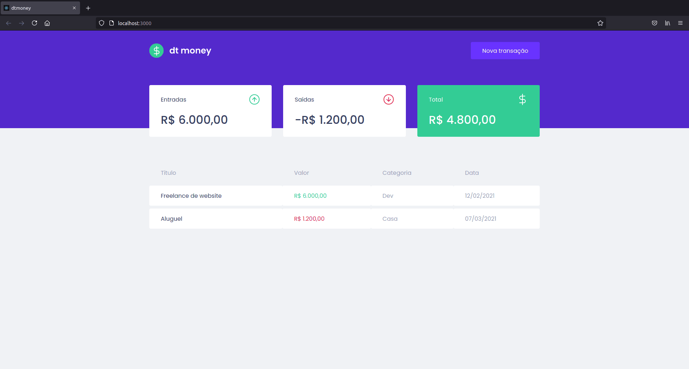

<h1 align="center">
dtmoney
</h1>

Um projeto para gerenciar entradas/saidas para melhorar o controle financeiro

  

[//]: # (Add your gifs/images here:)

  

## Features
[//]: # (Add the features of your project here:)
Nessa aplicação foram utilizados as seguintes tecnologias abaixo:

- **React Js** — Uma biblioteca para construção de interfaces web
- **Javascript** — Uma linguagem de programação utilizada tanto no cliente quanto no servidor
- **Typescript** — Um super set que adiciona tipagem estatica ao javascript
- **Styled Components** - Um pacote que auxilia nas estilizações das páginas, permite escrever código CSS em arquivos javascript

## Getting started

Primeiro faça o clone do repositório:  
    `git clone {url repositório}`   
Entre na pasta do projeto:  
    `cd dtmoney`   
Execute o comando para baixar os pacotes:  
    `yarn` ou `npm`   
Agora inicie o projeto:  
    `yarn start` ou `npm run start`   

## License

This project is licensed under the MIT License - see the [LICENSE](https://opensource.org/licenses/MIT) page for details.
